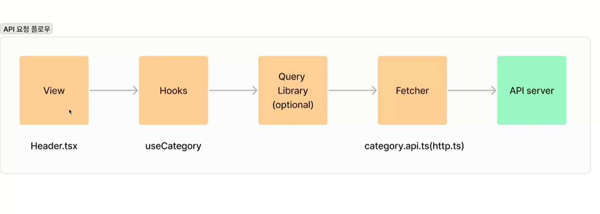

# pageTurner

### 폴더 구조

- pages : 라우트에 대응하는 페이지 컴포넌트
- components : 공통 컴포넌트
- utils : 유틸리티
- hooks : 리액트 훅
- model : 모델
- api

---

### 설치된 패키지

- sanitize css : 다양한 브라우저에서 스타일의 일관성을 유지해줌
- styled components : CSS-in-JS 방식으로 컴포넌트별로 스타일을 관리
- @types/testing-library\_\_react : 컴포넌트 테스트를 위함
- react-icons : 리액트 아이콘을 사용하기 위함
- react-router-dom : 라우팅을 관리하기 위함
- axios : http 요청을 도와줌
- react-hook-form : form 관리 및 유효성 검사를 하기 위함
- zustand : 상태 관리를 위한 라이브러리
- dayjS : 날짜를 나타내주는 라이브러리
- tanstack-query : 서버 상태를 관리하는 라이브러리
- msw : API 요청을 모킹하여 개발과 테스트를 용이하게 만들어 주는 라이브러리
- faker-js : 가짜 데이터들을 사용하기 위함
- Slick : 슬라이더 이미지를 구현하는 도움을 주는 라이브러리
- react-slick-carousel : slick을 사용해서 만든 이미지 슬라이더

---

### global style

- reset css

- normalize css

- sanitize css

---

### styled components

1. 전역 충돌 방지
2. 의존성 관리
3. 불필요한 코드 , 오버라이딩 방지
4. 상태 공유
5. 동적 스타일링

---

### thema 사용 이유

1. UI , UX의 일관성 유지
2. 유지보수 용이
3. 확장성
4. 재사용성
5. 사용자 정의

ThemeProvider : 테마를 애플리케이션에 적용하는 데 사용되는 컴포넌트

---

### context api

전역 상태를 관리하고 여러 컴포넌트 간에 데이터를 전달하는데 사용

---

### API flow

[레이아웃별로 고려하면 좋은 점]

렌더영역 깔끔하게 유지

---

### 작업 중간 회고

- 회고하는 이유

  - 1. 성장과 학습
  - 2. 문제 해결
  - 3. 유연성과 적응성
  - 4. 퍼포먼스 향상

  - "더 잘 하려고"

- 주요 학습 주제

  - 1. 타입과 모델 (Theme , Model(pick , omit, extends))
  - 2. 데이터 흐름 (hook)
  - 3. 컴포넌트 작성
  - 4. CSS 스타일링
  - 5. 커스텀 훅

- 생산성

  - 스니펫 사용 (컴포넌트 생성)
  - 기능 단위 작업 흐름 파악 (자기만의 흐름을 파악하고 개선하기)

- KPT (keep problem try)

  - keep

    - 회원가입 ~ 주문까지 경험
    - 생산성 고려
    - 데이터 흐름 맞추기

  - problem

    - 테마스위치
    - 중복 코드
    - css 스타일링 정리
    - import alias

  - try
    - 테마스위치 재배치
    - alias 적용
    - 중복코드 제거
    - useAuth 훅

---
